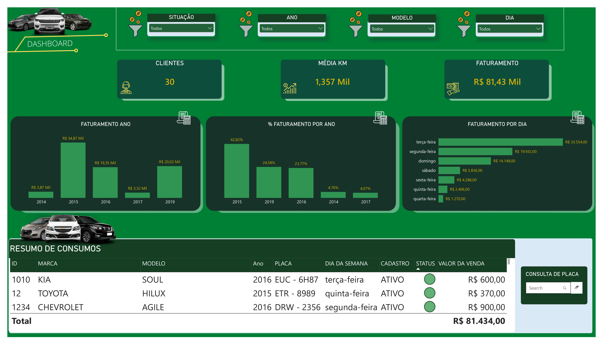
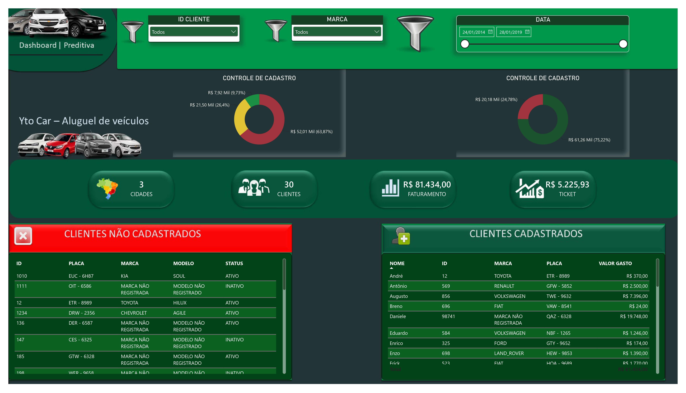
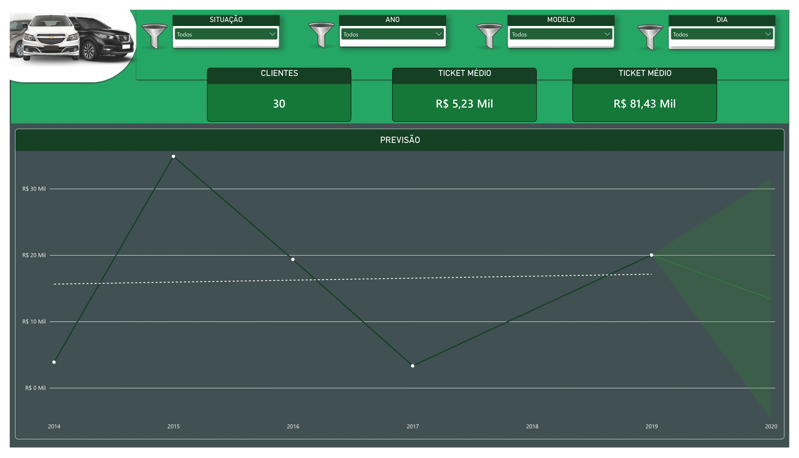

# BI Locadora de Carros

Dashboard desenvolvido em **Power BI** para análise de uma operação de locação de veículos, com foco no acompanhamento de indicadores financeiros, clientes e veículos.

---

## Sobre o Projeto

Este projeto foi desenvolvido com o objetivo de transformar dados de uma operação de locação de veículos fictícia em **informações visuais e indicadores relevantes para análise do negócio**.

O dashboard reúne diferentes perspectivas da operação, permitindo acompanhar informações relacionadas a **faturamento, clientes, veículos, quilometragem e evolução dos indicadores ao longo do tempo**.

---

## Objetivo

Criar uma solução de **Business Intelligence** capaz de apresentar os principais indicadores da operação de forma clara e interativa, facilitando o acompanhamento dos resultados e a identificação de padrões nos dados.

---

## Principais Análises

O dashboard permite analisar diferentes aspectos da operação, incluindo:

- **Faturamento** ao longo do tempo;
- **Quantidade de clientes**;
- **Ticket médio**;
- **Quilometragem média dos veículos**;
- **Marcas e modelos** dos veículos;
- **Distribuição das locações por dia da semana**;
- **Situação cadastral**;
- Relação entre **clientes e veículos**;
- Evolução dos principais indicadores ao longo do tempo.

---

## Estrutura do Dashboard

### Locação de Veículos

A página principal apresenta uma visão geral da operação, reunindo indicadores relacionados a **faturamento, clientes, veículos e quilometragem**.

Também permite analisar a distribuição das locações ao longo do tempo e por dia da semana, além de informações relacionadas aos veículos utilizados na operação.

### Clientes

A página de clientes apresenta informações relacionadas à base de clientes, permitindo analisar indicadores como:

- Quantidade de clientes;
- Faturamento;
- Ticket médio;
- Distribuição por localização;
- Situação cadastral;
- Relação entre clientes e veículos.

### Previsão

A página de previsão apresenta uma análise da evolução dos indicadores ao longo do tempo, permitindo observar tendências e auxiliar no acompanhamento do desempenho da operação.

---

## Principais Indicadores

| Indicador | Descrição |
|---|---|
| **Faturamento** | Acompanhamento da receita gerada pelas locações |
| **Clientes** | Quantidade e distribuição da base de clientes |
| **Ticket Médio** | Valor médio das locações |
| **Quilometragem Média** | Média de quilômetros associada aos veículos |
| **Veículos** | Análise da frota, marcas e modelos |
| **Evolução Temporal** | Acompanhamento dos indicadores ao longo do tempo |

---

## Tecnologias Utilizadas

- **Microsoft Power BI**
- **DAX**
- **Power Query**
- **Modelagem de Dados**
- **Visualização de Dados**
- **Business Intelligence**

---

## Dashboard

### Visão Geral

### Clientes

### Previsão

---

## Aprendizados

O desenvolvimento deste projeto permitiu aplicar conhecimentos relacionados a:

- Tratamento e transformação de dados utilizando **Power Query**;
- Criação de medidas e cálculos utilizando **DAX**;
- Modelagem e relacionamento entre dados;
- Criação de indicadores e **KPIs**;
- Desenvolvimento de dashboards interativos;
- Escolha e organização de visualizações;
- Análise e apresentação de dados para apoio à tomada de decisão.

---

## Autor

Desenvolvido por **Henry Mateus** como projeto prático de desenvolvimento de conhecimentos em **Power BI, Business Intelligence e Análise de Dados. No dia 03/09/2026**.
